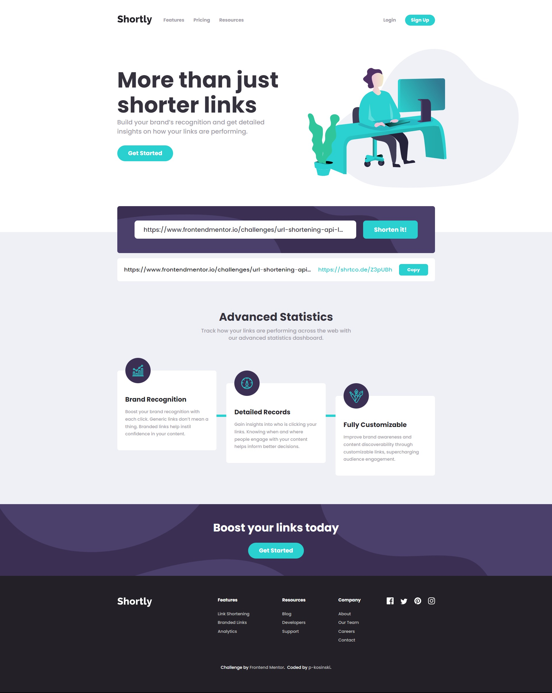

# Frontend Mentor - Shortly URL shortening API Challenge solution

This is a solution to the [Shortly URL shortening API Challenge challenge on Frontend Mentor](https://www.frontendmentor.io/challenges/url-shortening-api-landing-page-2ce3ob-G). Frontend Mentor challenges help you improve your coding skills by building realistic projects. 

## Table of contents

- [Overview](#overview)
    - [The challenge](#the-challenge)
    - [Screenshot](#screenshot)
    - [Links](#links)
- [Project setup](#project-setup)
    - [Setup](#setup)
    - [Available Scripts](#available-scripts)
- [My process](#my-process)
    - [Built with](#built-with)
    - [What I learned](#what-i-learned)
    - [Useful resources](#useful-resources)
- [Author](#author)

## Overview

### The challenge

Users should be able to:

- View the optimal layout for the site depending on their device's screen size
- Shorten any valid URL
- See a list of their shortened links, even after refreshing the browser
- Copy the shortened link to their clipboard in a single click
- Receive an error message when the `form` is submitted if:
    - The `input` field is empty

### Screenshot



### Links

- Solution URL [here](https://www.frontendmentor.io/solutions/url-shortening-api-reactjs-solution-V3PeBko93X).
- Live Site URL [here](https://verdant-pony-554f00.netlify.app/).

## Project Setup

### Setup

#### 1. Make sure you have **node.js** JavaScript runtime and **npm** package manager installed

If you haven't done it already, install [node.js](https://nodejs.org/en/). [NPM](https://www.npmjs.com/) package manager will be installed with it.

#### 2. Install project dependencies

To install project dependencies, run following command in the project directory:
`npm install`

### Available Scripts

In the project directory, you can run:

#### `npm start`

Runs the app in the development mode.\
Open [http://localhost:3000](http://localhost:3000) to view it in your browser.

The page will reload when you make changes.\
You may also see any lint errors in the console.

#### `npm test`

Launches the test runner in the interactive watch mode.\
See the section about [running tests](https://facebook.github.io/create-react-app/docs/running-tests) for more information.

#### `npm run test:coverage`

Launches all test suites and creates coverage report

#### `npm run build`

Builds the app for production to the `build` folder.\
It correctly bundles React in production mode and optimizes the build for the best performance.

The build is minified and the filenames include the hashes.\
Your app is ready to be deployed!

See the section about [deployment](https://facebook.github.io/create-react-app/docs/deployment) for more information.

#### `npm run eject`

**Note: this is a one-way operation. Once you `eject`, you can't go back!**

If you aren't satisfied with the build tool and configuration choices, you can `eject` at any time. This command will remove the single build dependency from your project.

Instead, it will copy all the configuration files and the transitive dependencies (webpack, Babel, ESLint, etc) right into your project so you have full control over them. All of the commands except `eject` will still work, but they will point to the copied scripts so you can tweak them. At this point you're on your own.

You don't have to ever use `eject`. The curated feature set is suitable for small and middle deployments, and you shouldn't feel obligated to use this feature. However we understand that this tool wouldn't be useful if you couldn't customize it when you are ready for it.

## My process

### Built with

- Semantic HTML5 markup
- Flexbox
- CSS Grid
- [SASS](https://sass-lang.com/) modules - CSS pre-processor (SCSS syntax)
- [Create React App](https://create-react-app.dev/) - local dev environment toolchain
- [React](https://reactjs.org/) - JS library
- [Jest](https://jestjs.io/) - JS testing framework
- [React Testing Library](https://testing-library.com/docs/react-testing-library/intro/) - JS library for testing react components without implementation details
- [Mock Service Worker](https://mswjs.io/) - library for mocking API for testing purposes
- [jest-localstorage-mock](https://github.com/clarkbw/jest-localstorage-mock) - library for mocking localStorage for testing purposes quickly

### What I learned

#### - creating custom react hooks

```js
import { useState, useEffect } from 'react';

function getStorageValue(key, defaultValue) {
  const initialValue = JSON.parse(localStorage.getItem(key));

  return initialValue || defaultValue;
};

export const useLocalStorage = (key, defaultValue) => {
  const [value, setValue] = useState(() => {
    return getStorageValue(key, defaultValue);
  });

  useEffect(() => {
    localStorage.setItem(key, JSON.stringify(value));
  }, [key, value]);

  return [value, setValue];
};
```
```js
...
const [shortenedLinks, changeShortenedLinks] = useLocalStorage(
  'shortenedLinks', []
);
...
```

#### - mocking browser and third party APIs for testing

```js
import { rest } from 'msw';

export const handlers = [
  rest.get('https://api.shrtco.de/v2/shorten', (req, res, ctx) => {
    const invalidLinkExample = 'https://shrtco.de/docs/';
    const requestUrlParam = req.url.searchParams.get('url');

    if(requestUrlParam !== invalidLinkExample) {
      return res(
        ctx.status(200),
        ctx.json({
          ok: true,
          result: {
            code: 'Iz3htH',
            original_link: requestUrlParam,
            full_short_link: 'https://shrtco.de/Iz3htH',
          },
        }),
      );
    } else {
      return res(
        ctx.status(400),
        ctx.json({
          ok: false,
          error: 'You have provided invalid link',
        })
      );
    }
  })
];
```

```js
import { setupServer } from 'msw/node';
import { handlers } from './handlers';

export const server = setupServer(...handlers);
```

```js
import '@testing-library/jest-dom';
import { server } from './mocks/server';
require('jest-localstorage-mock');

const originalClipboard = { ...global.navigator.clipboard };

beforeAll(() => server.listen());
beforeEach(() => {
  localStorage.clear();
  jest.clearAllMocks();
  localStorage.setItem.mockClear();

  let clipboardData = '';

  const mockClipboardAPI = {
    writeText: jest.fn((data) => { clipboardData = data }),
    readText: jest.fn(() => { return clipboardData }),
  };
  
  global.navigator.clipboard = mockClipboardAPI;
});
afterEach(() => {
  server.resetHandlers();
  global.navigator.clipboard = originalClipboard;
});
afterAll(() => server.close());
```

#### - react components integration testing with React Testing Library

```js
it('copies shortened link after clicking \'Copy\' button', async () => {
  render(<ShortenLinks />);

  const form = screen.getByLabelText('shorten links');
  const linksList = screen.getByRole('list');
  const input = within(form).getByRole('textbox');
  const submitButton = within(form).getByRole('button');

  const linkToShorten = 'https://www.frontendmentor.io/home';

  fireEvent.change(input, {target: {value: linkToShorten}});
  fireEvent.click(submitButton);

  const shortenedLinkElement = await within(linksList).findByRole('listitem');

  const mockedShortenedUrl = 'https://shrtco.de/Iz3htH';
  const copyButton = within(shortenedLinkElement).getByLabelText('Copyshortened link');

  fireEvent.click(copyButton);

  await waitFor(() => {
    expect(copyButton).toHaveTextContent('Copied!');
  });

  expect(navigator.clipboard.writeText).toBeCalledTimes(1);
  expect(navigator.clipboard.writeText).toHaveBeenCalledWit(mockedShortenedUrl)
  expect(navigator.clipboard.readText()).toBe(mockedShortenedUrl);
  });
```

### Useful resources

- [React Testing Library Tutorial](https://www.youtube.com/playlist?list=PL4cUxeGkcC9gm4_-5UsNmLqMosM-dzuvQ) - This is a youtube playlist with React Testing Library tutorials which helped me understand integration tests. I'd recommend it to anyone still learning this concept.

## Author

- Github - [@p-kosinski](https://github.com/p-kosinski)
- Frontend Mentor - [@p-kosinski](https://www.frontendmentor.io/profile/p-kosinski)